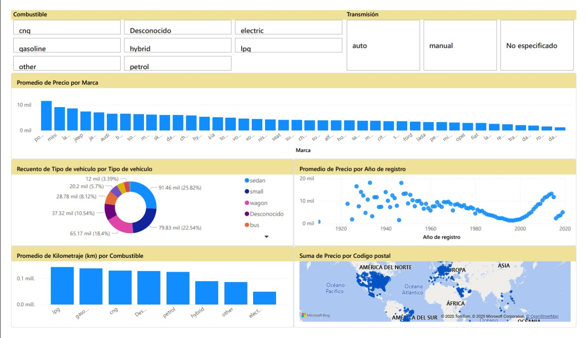

# 📊 Dashboard de Análisis de Autos Usados

Este proyecto fue desarrollado en **Power BI** con el objetivo de analizar un dataset de más de **350,000 anuncios de autos usados**. El dashboard permite explorar las principales características del mercado de vehículos, identificando tendencias, precios y distribución por tipo de auto, marca y otros factores.  

## 🔍 Objetivos del análisis
- Entender la **distribución de tipos de vehículos** en el mercado.  
- Comparar el **precio promedio por marca y año de registro**.  
- Analizar la relación entre **kilometraje, potencia y precio**.  
- Visualizar la oferta de autos en distintas zonas (por código postal).  
- Facilitar la exploración mediante **filtros interactivos** (transmisión, tipo de combustible, etc.).  

## 🛠️ Tecnologías utilizadas
- **Power BI Desktop** → creación del dashboard interactivo.  
- **Power Query** → limpieza y transformación de datos.  
- **DAX** (Data Analysis Expressions) → medidas personalizadas.  
- Dataset en **CSV** con ~354,000 registros y 16 columnas.  

## 📈 Visualizaciones incluidas
1. Precio promedio por marca.  
2. Distribución de tipos de vehículo.  
3. Relación entre año de registro y precio.  
4. Kilometraje promedio por tipo de combustible.  
5. Mapa de anuncios por código postal.  

## 🚀 Resultados
El dashboard facilita la identificación de patrones clave, como:  
- Alta concentración de vehículos **compactos (small)** en el mercado (~22%).  
- Diferencias notables de **precio promedio entre marcas premium y generalistas**.  
- Tendencia de **reducción de precio en vehículos más antiguos**.  
- Variaciones en **kilometraje promedio según el tipo de combustible**.  
